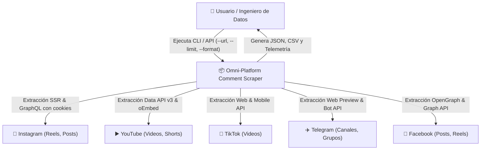
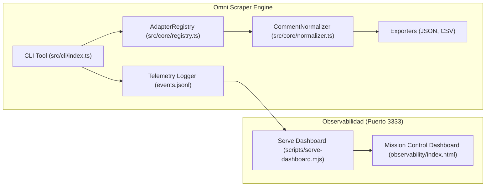
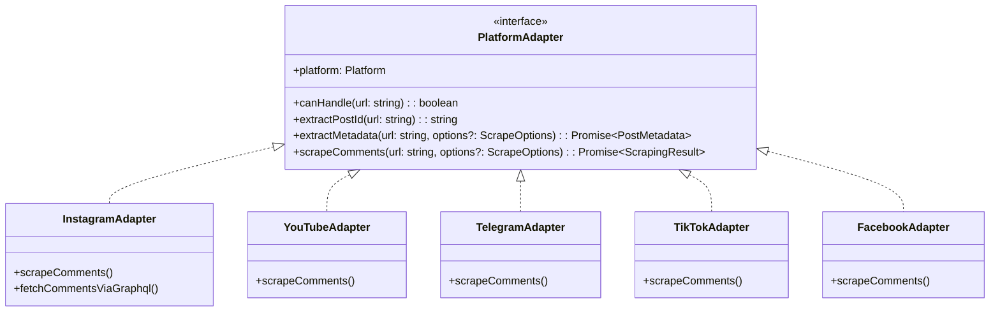

# 🏛️ Modelo C4: Omni-Platform Social Comment Scraper

## 1. Nivel 1: Diagrama de Contexto del Sistema

## 2. Nivel 2: Diagrama de Contenedores

## 3. Nivel 3: Diagrama de Componentes (Arquitectura Hexagonal)

