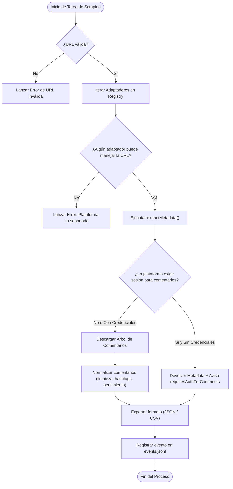

# ACT-001: Diagrama de Actividad - Resolución y Ejecución de Adaptador

```mermaid
flowchart TD
    Start(["Inicio de Tarea de Scraping"]) --> ValidateInput{"¿URL válida?"}
    
    ValidateInput -- No --> RaiseError["Lanzar Error de URL Inválida"]
    ValidateInput -- Sí --> FindAdapter["Iterar Adaptadores en Registry"]

    FindAdapter --> AdapterFound{"¿Algún adaptador puede manejar la URL?"}
    AdapterFound -- No --> PlatformUnsupported["Lanzar Error: Plataforma no soportada"]
    AdapterFound -- Sí --> FetchMetadata["Ejecutar extractMetadata()"]

    FetchMetadata --> CheckAuthReq{"¿La plataforma exige sesión para comentarios?"}
    
    CheckAuthReq -- Sí y Sin Credenciales --> ReturnPublicOnly["Devolver Metadata + Aviso requiresAuthForComments"]
    CheckAuthReq -- No o Con Credenciales --> FetchCommentThreads["Descargar Árbol de Comentarios"]

    FetchCommentThreads --> NormalizeLoop["Normalizar comentarios (limpieza, hashtags, sentimiento)"]
    NormalizeLoop --> ExportStep["Exportar formato (JSON / CSV)"]
    ReturnPublicOnly --> ExportStep

    ExportStep --> EmitTelemetry["Registrar evento en events.jsonl"]
    EmitTelemetry --> End(["Fin del Proceso"])
```
