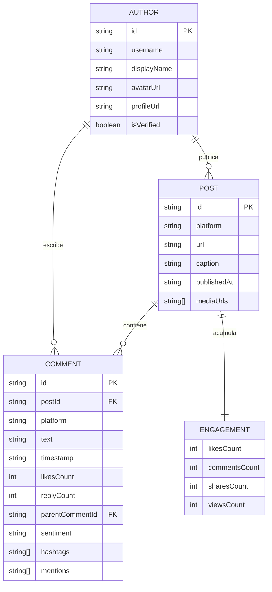

# ERD-001: Modelo de Entidades y Datos de Comentarios

```mermaid
erDiagram
    POST ||--o{ COMMENT : "contiene"
    AUTHOR ||--o{ POST : "publica"
    AUTHOR ||--o{ COMMENT : "escribe"
    POST ||--|| ENGAGEMENT : "acumula"

    POST {
        string id PK
        string platform
        string url
        string caption
        string publishedAt
        string[] mediaUrls
    }

    AUTHOR {
        string id PK
        string username
        string displayName
        string avatarUrl
        string profileUrl
        boolean isVerified
    }

    COMMENT {
        string id PK
        string postId FK
        string platform
        string text
        string timestamp
        int likesCount
        int replyCount
        string parentCommentId FK
        string sentiment
        string[] hashtags
        string[] mentions
    }

    ENGAGEMENT {
        int likesCount
        int commentsCount
        int sharesCount
        int viewsCount
    }
```
