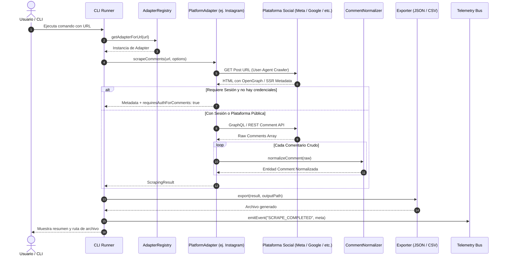

# SEQ-001: Diagrama de Secuencia - Flujo de Scraping y Normalización

```mermaid
sequenceDiagram
    autonumber
    actor User as Usuario / CLI
    participant CLI as CLI Runner
    participant Registry as AdapterRegistry
    participant Adapter as PlatformAdapter (ej. Instagram)
    participant Target as Plataforma Social (Meta / Google / etc.)
    participant Normalizer as CommentNormalizer
    participant Exporter as Exporter (JSON / CSV)
    participant Telemetry as Telemetry Bus

    User->>CLI: Ejecuta comando con URL
    CLI->>Registry: getAdapterForUrl(url)
    Registry-->>CLI: Instancia de Adapter
    CLI->>Adapter: scrapeComments(url, options)
    
    Adapter->>Target: GET Post URL (User-Agent Crawler)
    Target-->>Adapter: HTML con OpenGraph / SSR Metadata
    
    alt Requiere Sesión y no hay credenciales
        Adapter-->>CLI: Metadata + requiresAuthForComments: true
    else Con Sesión o Plataforma Pública
        Adapter->>Target: GraphQL / REST Comment API
        Target-->>Adapter: Raw Comments Array
        loop Cada Comentario Crudo
            Adapter->>Normalizer: normalizeComment(raw)
            Normalizer-->>Adapter: Entidad Comment Normalizada
        end
        Adapter-->>CLI: ScrapingResult
    end

    CLI->>Exporter: export(result, outputPath)
    Exporter-->>CLI: Archivo generado
    CLI->>Telemetry: emitEvent("SCRAPE_COMPLETED", meta)
    CLI-->>User: Muestra resumen y ruta de archivo
```
