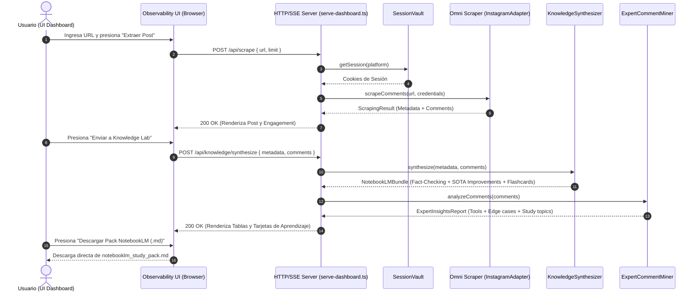

# SEQ-002: Diagrama de Secuencia - Síntesis de Conocimiento y Minería de Expertos

```mermaid
sequenceDiagram
    autonumber
    actor User as Usuario (UI Dashboard)
    participant UI as Observability UI (Browser)
    participant Server as HTTP/SSE Server (serve-dashboard.ts)
    participant Vault as SessionVault
    participant Scraper as Omni Scraper (InstagramAdapter)
    participant Synth as KnowledgeSynthesizer
    participant Miner as ExpertCommentMiner

    User->>UI: Ingresa URL y presiona "Extraer Post"
    UI->>Server: POST /api/scrape { url, limit }
    Server->>Vault: getSession(platform)
    Vault-->>Server: Cookies de Sesión
    Server->>Scraper: scrapeComments(url, credentials)
    Scraper-->>Server: ScrapingResult (Metadata + Comments)
    Server-->>UI: 200 OK (Renderiza Post y Engagement)

    User->>UI: Presiona "Enviar a Knowledge Lab"
    UI->>Server: POST /api/knowledge/synthesize { metadata, comments }
    Server->>Synth: synthesize(metadata, comments)
    Synth-->>Server: NotebookLMBundle (Fact-Checking + SOTA Improvements + Flashcards)
    
    Server->>Miner: analyzeComments(comments)
    Miner-->>Server: ExpertInsightsReport (Tools + Edge cases + Study topics)

    Server-->>UI: 200 OK (Renderiza Tablas y Tarjetas de Aprendizaje)
    User->>UI: Presiona "Descargar Pack NotebookLM (.md)"
    UI-->>User: Descarga directa de notebooklm_study_pack.md
```
