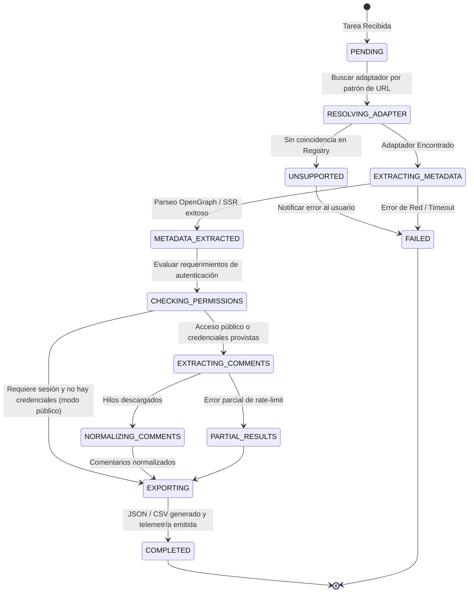

# STM-001: Máquina de Estados - Ciclo de Vida de una Tarea de Scraping

```mermaid
stateDiagram-v2
    [*] --> PENDING: Tarea Recibida

    PENDING --> RESOLVING_ADAPTER: Buscar adaptador por patrón de URL
    RESOLVING_ADAPTER --> UNSUPPORTED: Sin coincidencia en Registry
    UNSUPPORTED --> FAILED: Notificar error al usuario

    RESOLVING_ADAPTER --> EXTRACTING_METADATA: Adaptador Encontrado
    EXTRACTING_METADATA --> METADATA_EXTRACTED: Parseo OpenGraph / SSR exitoso
    EXTRACTING_METADATA --> FAILED: Error de Red / Timeout

    METADATA_EXTRACTED --> CHECKING_PERMISSIONS: Evaluar requerimientos de autenticación
    CHECKING_PERMISSIONS --> EXPORTING: Requiere sesión y no hay credenciales (modo público)
    CHECKING_PERMISSIONS --> EXTRACTING_COMMENTS: Acceso público o credenciales provistas

    EXTRACTING_COMMENTS --> NORMALIZING_COMMENTS: Hilos descargados
    EXTRACTING_COMMENTS --> PARTIAL_RESULTS: Error parcial de rate-limit
    
    NORMALIZING_COMMENTS --> EXPORTING: Comentarios normalizados
    PARTIAL_RESULTS --> EXPORTING

    EXPORTING --> COMPLETED: JSON / CSV generado y telemetría emitida
    COMPLETED --> [*]
    FAILED --> [*]
```
